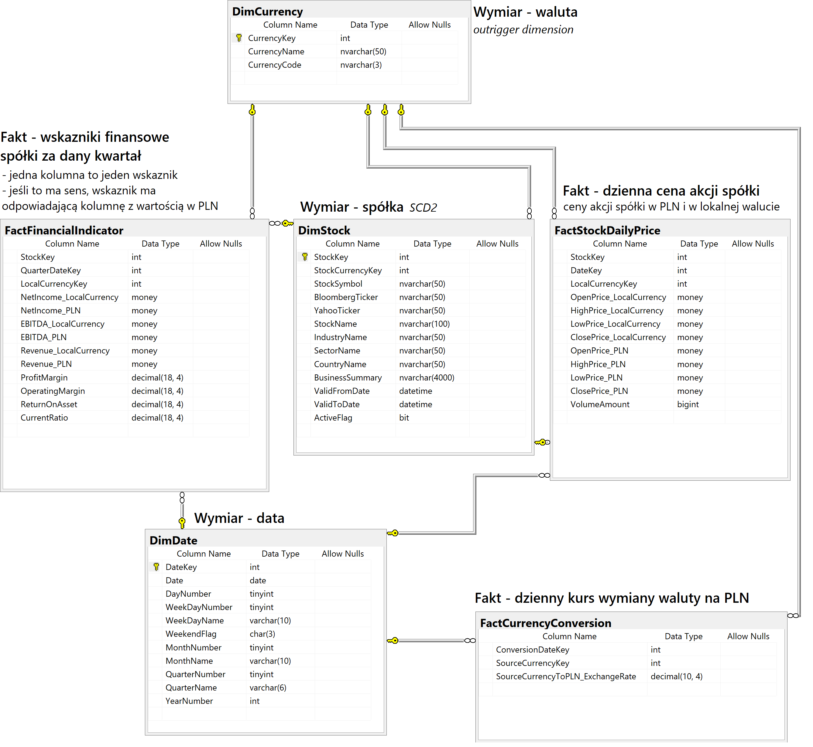
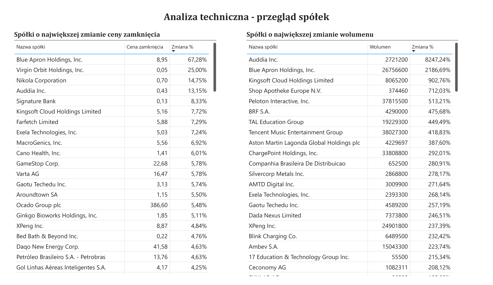
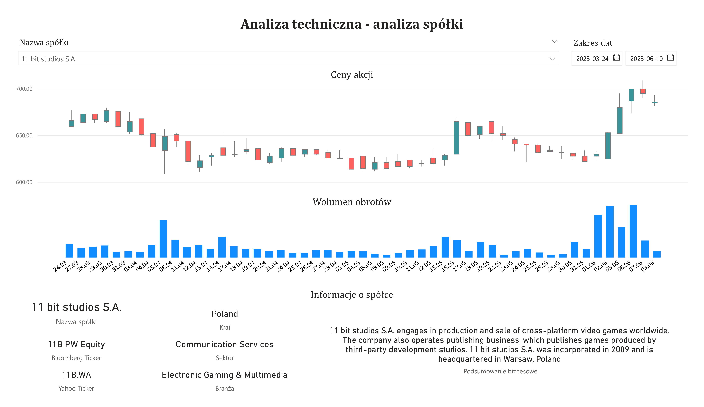
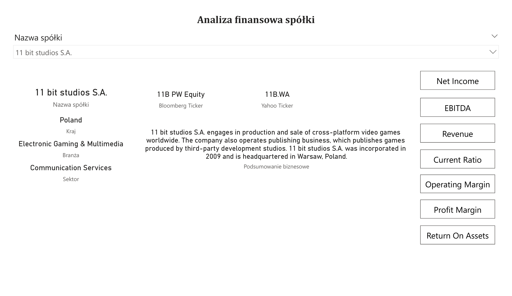
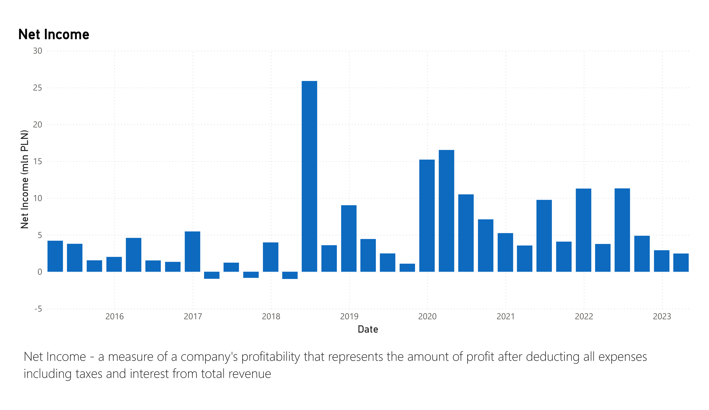

# DWH/BI solution for stock prices analysis
Comprehensive project encompassing the design of data structures, configuration of the ETL process, and populating data into the data warehouse structures, as well as data analysis in the Business Intelligence system.

---

## Data warehouse model

---

## Reports

